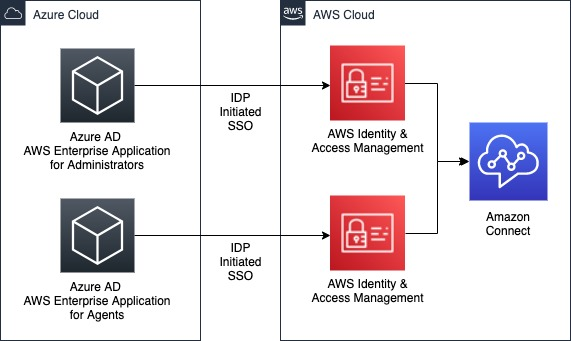

### Azure AD 

Azure AD is a SAML-based authentication plugin that works with Azure AD identity provider. This plugin does not support multifactor authentication (MFA). 

If you require MFA support, consider using the BrowserAzureAD plugin instead.

Configure single sign-on using Microsoft Azure Active Directory for Amazon Connect

#### Single Sign-On (SSO) 

https://aws.amazon.com/blogs/contact-center/configure-single-sign-on-using-microsoft-azure-active-directory-for-amazon-connect/

Single sign-on (SSO) enables users to access multiple applications securely via a single ID and password. This reduces the headache of remembering multiple username and passwords for users in an organization.

Amazon Connect supports identity federation with Security Assertion Markup Language (SAML) 2.0 to enable web-based single sign-on (SSO) from your organization to your Amazon Connect instance.

#### Overview of solution

The following architecture diagram depicts two Azure AD AWS Enterprise Applications that federate via Identity Provider initiated SSO to AWS Identity and Access Management (IAM). This helps grant access to your Amazon Connect Instance. The first application is created for Administrators of your contact center. The second application is created for agents.

#### Walkthrough

The high-level steps that we will walk through in this post are as follows:

Create IAM policies to enable federation of Azure AD to access AWS resources

Create an IAM user with AWS Command Line Interface (CLI) access and apply IAM policies

Download IAM user credentials for Azure AD provisioning access

From Azure AD create an AWS SAML Enterprise application and the download the ‘Federation Metadata XML’. This application will be your Azure AD application for Administrators

Create an IAM identity provider, a role, apply policies, and upload the federation metadata XML

Within Azure AD enter your IAM user credentials, enable Provisioning, and test the AWS SAML application

Within Azure AD assign your Amazon Connect administrator to the Azure AD SAML application and assign appropriate role
    
Test the application

Add administrator users to Amazon Connect and to Azure AD

Repeat similar steps to add a second Azure AD application for your agents

At the end of this blog post, you will have created two applications that will enable your administrators and agents to log into Amazon Connect using Azure AD SSO

<table class="table">
<thead>
<tr>
<th>Connection string name</th>
<th>Parameter type</th>
<th>Default value</th>
<th>Connection string example</th>
</tr>
</thead>
<tbody>
<tr>
<td>AuthenticationType</td>
<td>Required</td>
<td>IAM Credentials</td>
<td>AuthenticationType=AzureAD;</td>
</tr>

<tr>
<td>preferred_role</td>
<td>Optional</td>
<td>none</td>
<td>preferred_role=arn:aws:iam::123456789012:id/user1;</td>
</tr>

<tr>
<td>duration</td>
<td>Optional</td>
<td>900</td>
<td>duration=900;</td>
</tr>

<tr>
<td>client_id</td>
<td>Required</td>
<td>none</td>
<td>client_id=9178ac27-a1bc-1a2b-1a2b-a123abcd1234;</td>
</tr>

<tr>
<td>client_secret</td>
<td>Required</td>
<td>none</td>
<td>client_secret=zG12q~.xzG1xxxZ1wX1.~ZzXXX1XxkHZizeT1zzZ;</td>
</tr>

<tr>
<td></td>
<td></td>
<td></td>
<td></td>
</tr>
</tbody>
</table>

## AD FS OpenID Connect/OAuth concepts

<table class="table">
<thead>
<tr>
<th>Name</th>
<th>Details</th>
</tr>
</thead>
<tbody>

<tr>
<td>End user</td>
<td>Application User</td>
</tr>

<tr>
<td>Client</td>
<td>web application, identified by its client ID. (Browser)</td>
</tr>

<tr>
<td>Authorization server</td>
<td>AD FS server. It's responsible for verifying the identity of security principals that exist in an organization's directory. It issues security tokens (bearer access token, ID token, and refresh token) upon successful authentication of those security principals.</td>
</tr>

<tr>
<td>Resource server</td>
<td>Where the resource or data resides.</td>
</tr>
</table>

#### Security tokens

**id_token:** A JWT token issued by authorization server (AD FS) and consumed by the client. Claims in the ID token contain information about the user so that client can use it.

**access_token:** A JWT token issued by authorization server (AD FS) and intended to be consumed by the resource. The 'aud' or audience claim of this token must match the identifier of the resource or web API.

**refresh_token:** Issued by AD FS for the client to use when it needs to refresh the id_token and access_token. The token is opaque to the client and only consumed by AD FS.

#### Refresh token lifetimes

**Simple logon**, no KMSI, device not registered: AD FS applies SsoLifetime and DeviceUsageWindowInDays. The first refresh token has lifetime=DeviceUsageWindowInDays or SsoLifetime, based on which field is lower but no further refresh tokens are issued.

**KMSI logon**, EnableKmsi=true in AD FS conf and kmsi=true passed as parameter: AD FS applies KmsiLifetimeMins with DeviceUsageWindowInDays. The first refresh token has lifetime=DeviceUsageWindowInDays and each subsequent grant_type=refresh_token request gets a new refresh token. This process happens only with native clients or confidential client plus device authentication.

**Registered devices**, device auth: AD FS uses PersistentSsoLifetimeMins and DeviceUsageWindowInDays similar to KMSI. Both native and confidential clients should get new refresh tokens, based on device authentication.

#### Scopes

When you register a resource in AD FS, you can configure scopes to let AD FS perform specific actions. Along with configuring the scope, you must send the scope value in the request for AD FS to perform the action. For example, an administrator configures the scope as openid during resource registration and the application (client) must send the scope = openid in the authentication request for AD FS to issue the ID Token. The following are details on the available scopes in AD FS:

- aza - If you use OAuth 2.0 protocol extensions for broker clients and if the scope parameter contains the scope aza
- openid - Lets the application request use of the openid connect authentication protocol.

- logon_cert - Lets an application request sign-in certificates that you can use to interactively log on authenticated users. see MS-OAPX: OAuth 2.0 protocol extensions.
- email - Lets the application request an email claim for the signed-in user.
- profile - Lets the application request profile-related claims for the signed-in user.

#### Claims

Security tokens (access and ID tokens) issued by AD FS contain claims, or assertions of information about the subject that has been authenticated. Applications can use claims for various tasks, including:

- Validate the token
- Identify the subject's directory tenant
- Display user information
- Determine the subject's authorization

#### High-level AD FS authentication flow

1. AD FS receives authentication request from the client.

2. AD FS validates the client ID in the authentication request with the client ID obtained during client and resource registration in AD FS. If using confidential client, then AD FS also validates the client secret provided in the authentication request. AD FS also validates the redirect URI of the Client.

3. AD FS identifies the resource that the client wants to access through the resource parameter that's passed in the authentication request. If you use the MSAL client library, the resource parameter isn't sent. Instead, the resource URL is sent as a part of the scope parameter: scope = [resource url]/[scope values, for example, openid].

4. If the resource isn't passed using the resource or scope parameters, AD FS uses a default resource urn:microsoft:userinfo whose policies, such as, MFA, issuance, or authorization policy, can't be configured.

5. Next AD FS validates whether the client has permissions to access the resource. AD FS also validates whether the scopes passed in the authentication request match the scopes configured while registering the resource. If the client doesn't have the permissions, or the right scopes aren't sent in the authentication request, the authentication flow terminates.

6. Once permissions and scopes validate, AD FS authenticates the user by using the configured authentication method.

7. If another authentication method is required as per the resource policy or the global authentication policy, AD FS triggers the extra authentication.

8. AD FS uses Microsoft Entra multifactor authentication or third-party multifactor authentication to do the authentication.

9. Once the user is authenticated, AD FS applies the claim rules. Claim rules determine the claims sent to the resource as a part of the security tokens. AD FS also applies the access control polices that confirm the user meets the required conditions to access the resource.

10. Next, AD FS generates the access and refreshes the tokens. AD FS also generates the ID token.

11. AD FS receives the authentication request.

12. If you include the scope = allatclaims in the authentication request, it customizes the ID token to include claims in the access token based on the defined claim rules.

13. Once the required tokens are generated and customized, AD FS responds to the client and includes the tokens. The ID token response is only included in the response if the authentication request includes scope = openid. The client can always get the ID token after authentication by using the token endpoint.

https://github.com/AzureAD/microsoft-authentication-library-for-java
