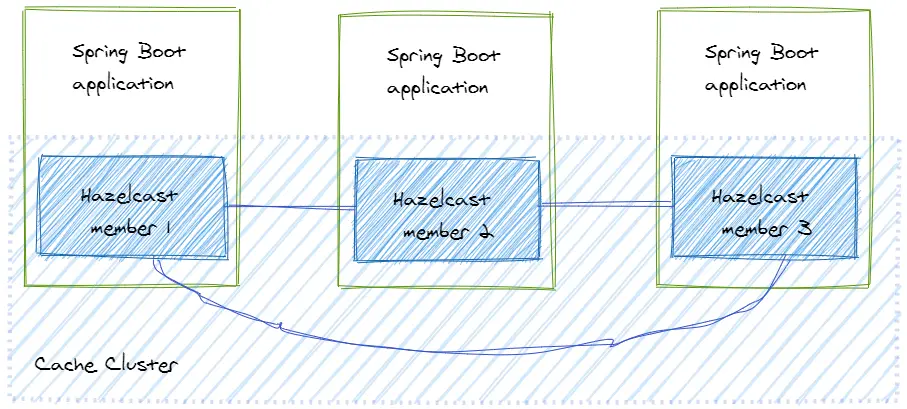

## Distributed Cache with Hazelcast and Spring

This article shows how to use Hazelcast as a cache with Spring in a distributed and scalable application.

Normally, an application reads data from storage, for example, from a database. If we want to increase the performance of reading or writing data, we can improve the hardware and make it faster. But this costs money.

**This is what we call a cache.**

If the application wants to access data, it requests the data in the cache. We know that the data in the cache are copies, and we cannot use them for a long time because the data in the primary storage can change. In this case, we would get a data inconsistency.

That’s why we need to define the validity time of the data in the cache. Also, we don’t want data in the cache that is not frequently requested. This data would only allocate resources of the cache but wouldn’t be used. In this case, we configure the time how long a data lives in the cache if it is not requested.

This is what we call **time-to-live** (TTL).

In a big enterprise system, there can be a cluster of caches. We have to replicate and synchronize the data in this cluster between the caches.

#### Hazelcast as a Distributed Cache

* Hazelcast is a distributed in-memory object store and provides many features including TTL, write-through, and scalability. 
* We can build a Hazelcast cluster by starting several Hazelcast nodes in a net. Each node is called a member.

##### There are two types of topologies we can implement with Hazelcast:

1. Embedded cache topology.
2. Client-server topology.

#### Embedded Cache Topology



Embedded Cache with Spring

Dependency 

```
<!-- https://mvnrepository.com/artifact/com.hazelcast/hazelcast -->
<dependency>
    <groupId>com.hazelcast</groupId>
    <artifactId>hazelcast</artifactId>
    <version>5.3.6</version>
</dependency>

```

Now let’s create a cache client for the application.

```

@Component
class CacheClient {

  public static final String CARS = "cars";
  private final HazelcastInstance hazelcastInstance
              = Hazelcast.newHazelcastInstance();

  public Car put(String number, Car car){
    IMap<String, Car> map = hazelcastInstance.getMap(CARS);
    return map.putIfAbsent(number, car);
  }

  public Car get(String key){
    IMap<String, Car> map = hazelcastInstance.getMap(CARS);
    return map.get(key);
  }
   
   // other methods omitted

}

```

That’s it. Now the application has a distributed cache. The most important part of this code is the creation of a cluster member. It happens by calling the method Hazelcast.newHazelcastInstance(). The method getMap() creates a Map in the cache or returns an existing one. The only thing we have to do to set the name of the Map.

When we want to scale our application, every new instance will create a new member and this member will join the cluster automatically.

Hazelcast provides several mechanisms for discovering the members. If we don’t configure any discovery mechanism, the default one is used, in which Hazelcast tries to find other members in the same network using multicast.

This approach has two advantages:

it’s very easy to set up the cluster, and
data access is very fast.
We don’t need to set up a separate cache cluster. It means we can create a cluster very fast by adding a couple of lines of code.

If we want to read the data from the cluster, the data access is low-latency, because we don’t need to send a request to the cache cluster over the network.

But it brings drawbacks too. Imagine we have a system that requires one hundred instances of our application. In this cluster topology, it means we would have one hundred cluster members even though we don’t need them. This big number of cache members would consume a lot of memory.

Also, replication and synchronizing would be pretty expensive. Whenever an entry is added or updated in the cache this entry would be synchronized with other members of the cluster, which causes a lot of network communication.

Also, we have to note that Hazelcast is a java library. That means, the member can be embedded in a java application only.