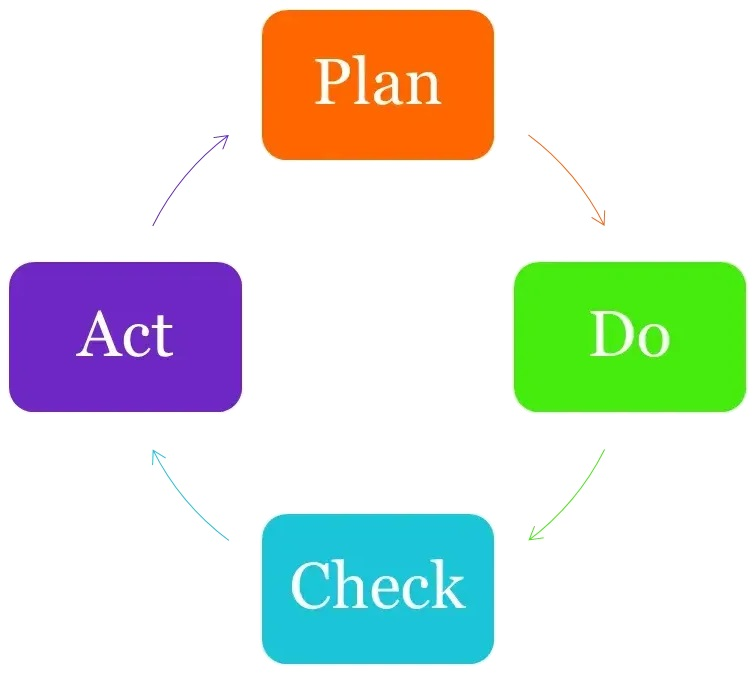
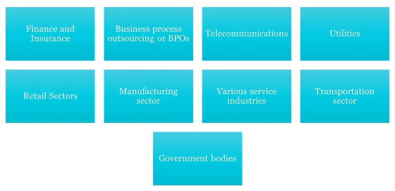
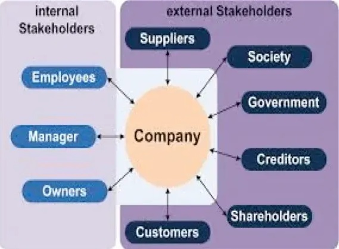

### Understanding ISO Standards

What is in an ISO standard ?

What is in an ISO standard ?
All ISO management standard is split in to 10 clauses, This allow for greater integration and understandability between different standard

The 10 clauses are

1. Scope
2. Normative References (Normative references are documents that must be read to understand or implement the technology in a new standard)
3. Terms and definition
4. Context of the Organization
5. Leadership
6. Planning
7. Support
8. Operation
9. Performance Evaluation
10. Improvement

#### Understanding ISO Standards

#### How does it work

ISO management standard run on the P-D-C-A Improvement cycle. It is an iterative process used to achieve continual improvement

**Plan**, the processes

Clause 4 - Context of the Organization

Clause 5 - Leadership

Clause 6 - Planning

**Do**,Implement the plan 

Clause 7 - Support

Clause 8 - Operation

**Check**, The results

Clause 9 - Performance Evaluation

**Act**, Take action to improve

Clause 10 - Improvement

#### Importance of Internal Audit

**What is an Internal Audit ?**

An Internal audit is an audit done by the organisation to assess the effectiveness of your organization’s management system and your organization's overall performance
It is also part of the requirement in the ISO standard

**Why conduct an internal audit?**

Ensuring compliance to the requirements of internal, international and industry standards & regulations, and customer requirements

- To determine the effectiveness of the implemented system in meeting specified objectives
- To explore opportunities for improvement
- To meet statutory and regulatory requirements
- To provide feedback to Top Management

#### Introduction to ISO 27001 – Information Security Management System

**What is It?**

- A comprehensive set of controls comprising best practices in information security
- An internationally recognized generic information security standard
- It is intended to serve as a single reference point for identifying a range of controls needed for most situations where information systems are used in industry and commerce
- Facilitation of trading in a trusted environment

#### Introduction to ISO 27001 – Information Security Management System

**Why have an ISO 27001 ISMS?**

**Heightened Security Awareness:**  An ISMS fosters a culture of security awareness throughout the organisation

**Critical Asset Identification:**  The business risk assessment process pinpoints an organisation's most valuable information assets

**Process Driven Security:** ISO 27001 emphasizes well-defined processes to manage information security effectively.

**Continuous Improvement Framework:**  The standard promotes ongoing review and improvement of security practices   

**Internal and External Confidence:**  Certification signals a strong commitment to information security, boosting trust among stakeholders and customers.

**Enhanced Management Engagement:** Management teams become more informed and active participants in protecting the organization's information assets. 

#### Terms and definitions

To avoid confusion and ensuring clarity by people from different nation and culture , all ISO has a chapter 3.0 Terms and definitions. The standard one that apply to all ISO standard are

Shall: Indicated a requirement

Should: Indicate a recommendation

May: Indicated a permission

Can: Indicate a possibility or capability

#### Terms and definitions

The terms and definitions can be found in ISO/IEC 27000 alternatively you can reference the following source

- ISO Online browsing platform: available at https://iso.org/obp
- IEC Electropedia: available at https://electropedia.org/
- The following section on this page contain standard specific definition

#### Requirements for ISMS – ISO 27001

1. Context of the organisation
2. Leadership
3. Planning
4. Support
5. Operation
6. Performance Evaluation
7. Improvement

#### Understanding the organization and its context

- Determine external and internal issues
- That is relevant to its purpose or
- Affect the ability to achieve the intended outcome of ISMS

**Notes**

    - Issues –either positive or negative factors or conditions

    - External issues – legal, technological, competitive, market, cultural, social and economic environment, whether international, national, regional or local

    - Internal issues – values, culture, knowledge and performance of the organization

#### Understanding the needs and expectations of interested parties

**Determine:** Interested parties that are relevant to the ISMS

Requirements of these interested parties relevant to information security as listed below;

    Legal requirement
    Regulatory requirements
    Contractual obligations
    Other requirements identified by organization

#### Determining the scope of the ISMS

Determine the boundaries and applicability of the ISMS to establish its scope .For determining the scope consider:

- External and internal issues
- The requirements 
- interfaces and dependencies between activities performed
- The documented information related to scope of ISMS is kept in ISMS manual or separate scope document

#### Actions to address risks and opportunities

- As mention in section 6.1.3,treatment of information security risk must consider a list of control outlined in Annex A of ISO 27001 : 2022 standard

- If any are excluded , justification must be provided

- these control are broken down in to 4 main groups

#### Actions to address risks and opportunities

ANNEX A

The following is a list of control as outlined in the standard. do remember this is a non exhaustive list of control and that the organization should always consider additional measure beyond this list

#### Information security objectives and planning to achieve them

Objective should be established at relevant function and level and shall be

- Consistent with the information security policy
- Measurable
- Consider applicable IS requirements, and results from risk assessment and risk treatment
- Monitored communicated and updated as needed
- Documented

For planning of IS objectives determine

- What will be done;
- What resources will be required
- Who will be responsible
- When it will be completed
- How the results will be evaluated

#### Planning of changes

Change to the ISMS must be carried in a planned order to prevent any negative impact

- Determine what change need to be carried out
- Ensure that change can be justifiable
- Conduct analysis of the possible Risk and opportunities if such change were to proceed
- This can include post issue from the change
- Ensure a record and that it has been signed off by the required personnel
- Ensure no change can be done without proper approval

#### Support

- Resources
- Competence
- Awareness
- Communication
- Documented Information

#### Resources

Resources need to provided for the establishment , implementation , maintenance and continual improvement of the ISMS

This can include

- Financial
- Human resource
- Natural
- Infrastructure , facilities and equipment's
- Materials
- Specialized skills
- Technology

#### Competence

- Determine the competency required of the people that may affect information security performance . This include education training and experience
- Verify that all employee meet the relevant requirement and if they do not take relevant action to enable them to obtain the relevant competency
    - Action taken need to be evaluated for their effectiveness
    - Ensure only competent worker are allowed to carry out the job
- Record of employees' competency shall be kept as evidence

#### Awareness

People doing work under the organisation shall me made aware of the following

- Information security policy
- Their contribution to the effectiveness of ISMS and the benefits of improved information security performance
- The implications of not conforming with the ISMS requirements

#### Communication

The organisation need to establish a procedure to determine the following for both internal and external communication relating to the information security management system

- What to communicate?
- When to communicate?
- Whom to communicate?
- How to communicate

#### Documented Information

The organisation shall document information outline by the standard and any other relevant information deem necessary for an effective ISMS

**creating and updating**

When creating and updating document the following need to be appropriate to it context

- Identification and description of document
- Format of document
- Whether the document is review and approved for it suitability and adequacy

#### Control of Documented Information

Document relating to the ISMS need to be controlled to ensure

- That they are available and suitable for use where and when it is needed
- It adequately protected from loss confidentiality improper use or loss of integrity

The control of document shall include

- Distribution, access, retrieval, use
- Storage and preservation including the preservation of legibility
- Control of change
- Retention and disposition

Document of external origin that is needed by the ISMS shall identified and as appropriate control

#### Planning

##### Operation Planning and Control

- Plan, implement and control the processes
- Implement the actions from risks and opportunities
- Implement the risk treatment plan and controls to achieve the IS objectives
- Maintain documented information to establish confidence that the processes
- Control planned changes and review the consequences of unintended changes, taking action to mitigate any adverse effects as necessary
- Ensure that outsourced processes are determined and controlled
- Implement procedures and other controls

##### Information security risk assessment

- Perform information security risk assessments at planned intervals or when significant changes are proposed or occur, taking account of the criteria established
- Retain documented information of the results of risk assessments

##### Information security risk treatment

- Implement the information security risk treatment plan
- Retain documented information of the results of the information security risk treatment

#### Performance Evaluation

Monitoring, Measurement, Analysis, and Evaluation

Evaluate the information security performance and effectiveness of the ISMS and Determine:

- What needs to be monitored and measured, including IS processes and controls
- Which methods for monitoring, measurement, analysis and evaluation?
- When the monitoring and measuring to be performed?
- Who will monitor and measure?
- When the results from monitoring and measurement to be analyzed and evaluated
- Who will analyse and evaluate these results.

Retain documented information as evidence of the monitoring and measurement results.

#### Internal Audit

The standard require the organisation to conduct periodic internal audit to verify that the ISMS

- conform to The requirement of the ISO 27001:2022
- Conform to any other requirement the organisation need to meet
- Is Effectively implemented and maintained

An audit programme must consider the importance of the process being audited and previous audit result and cover the following

 - Frequency , Methods, responsibility, Planning requirement , Reporting

The organisation shall for each audit

 - Defined audit criteria and scope for each audit
 - Select auditor and conduct the audit objectively and impartiality
 - Ensure result of audit are reported to relevant management

Documented information shall be kept as evidence

#### Management Review

Management is required to review the ISMS at planned interval to ensure it continuing suitability adequacy and effectiveness.

- Management Review Input
    
  - The input of the review shall include
- The status of actions from previous management reviews;
  - Changes in external and internal issues that are relevant to the information security management system;
  - Changes in needs and expectations of interested parties that are relevant to the information security management system;

Feedback on the information security performance, including trends in:
    - nonconformities and corrective actions;
    - monitoring and measurement results;
    - audit results;
    - fulfilment of information security objectives;

- Feedback from interested parties;
- Results of risk assessment and status of risk treatment plan;
- Opportunities for continual improvement.
- Ensure result of audit are reported to relevant management
- Documented information shall be kept as evidence

##### Management Review Output

- Decisions related to continual improvement opportunities for effectiveness of system
- Any needs for changes to the ISMS and Modification of procedures that effect information security including changes to:
  - Business requirements
  - Security requirements
  - Business processes
  - Regulatory or legal environment
  - Levels of risk and/or levels of risk acceptance

- Retain documented information as an evidence of the results of management reviews ( Example: minutes of meeting )

#### Improvements

##### Continual Improvements

Continually improve the suitability, adequacy and effectiveness of the ISMS through the use of the

- Information security policy
- Security objectives
- Audit results
- Analysis of monitored events
- Corrective and preventive actions
- Management review

##### Nonconformity and corrective action

When a non conformity occur , The organisation shall

- Take action to control and correct it or deal with the consequences
- Evaluate the need for action to eliminate the causes of nonconformity
  - reviewing the nonconformity
  - determining the causes of the nonconformity
  - determining if similar nonconformities exist or could potentially occur
- Implement action needed
- Review the effectiveness of corrective action taken
- Make changes to the information security management system, if necessary.

Retain documented information as evidence of:

- Nature of the nonconformities and any subsequent actions taken
- Results of corrective action

