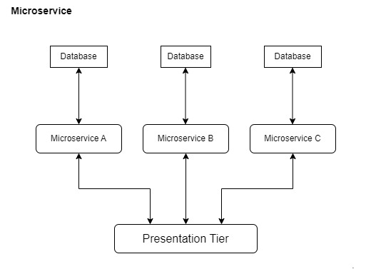
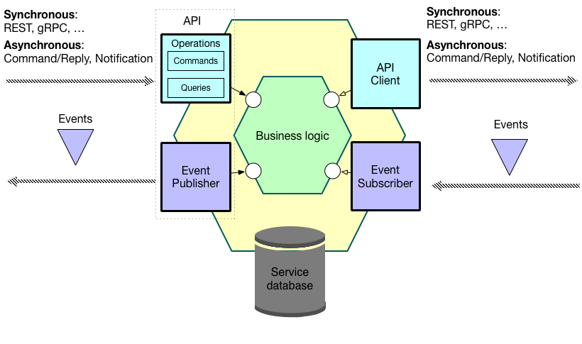
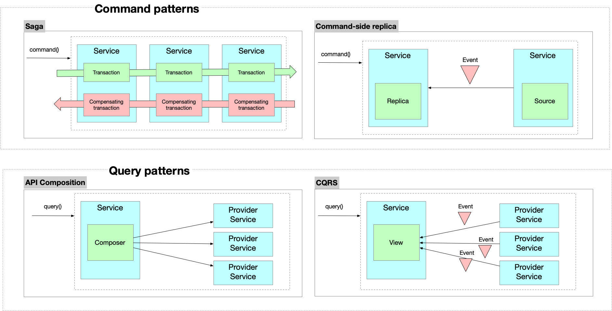
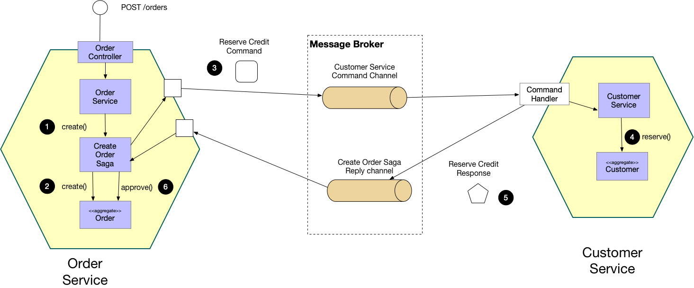
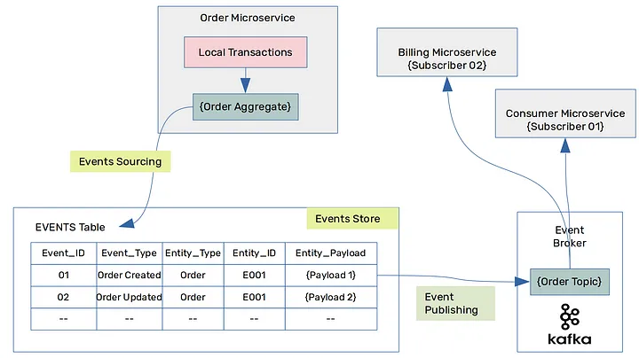

### Microservices

Microservice architecture - is an architectural style that structures an application as a collection of services that are:

- Independently deployable
- Loosely coupled

#### Microservices enable fast flow

IT deliver that software rapidly, frequently and reliably

#### Design microservices using Assemblage

The essence of applying the Microservice architecture pattern is defining the service architecture: identifying the services, defining their responsibilities, their APIs and their collaborations (with other services). Choosing the right technical architecture - deployment platform, message broker, etc

#### Incrementally refactor a monolith to microservices

The monolithic architecture is not an anti-pattern. It’s a good choice for small teams and small projects.

### A pattern language for microservices

**Microservice Architecture Context**: Developing a business-critical enterprise application. You need to deliver changes rapidly, frequently and reliably - as measured by the following metrics

- Deployment frequency - the frequency with which software changes are deployed to production.
- Lead time for changes - the time it takes to go from commit to deploy.
- Time to restore service - the time it takes to restore service after a production incident or outage.
- Change failure rate - the percentage of production deployments that result in a failure or require remediation.

**Pattern**: A pattern is a reusable solution to a problem that occurs in particular context.

**Query**: A query is an operation that retrieves data.

**Service**: Loosely coupled with other services, Independently deployable - it an independently deployable/executable component, such as a WAR file, executable JAR, EAR file, OSGI Bundle, or operating System executable, Owned by a small, cross-functional team

**System operation**: A system operation is an invocable behavior of the application. There are two types of operations: commands and queries. An operation is invoked by an application client - human via UI, or an external application - either synchronously or asynchronously. It might also be invoked by the passing of time, e.g. a batch job that is executed periodically.

#### Benefits

- Simple services: Each service consists of a small number of subdomains - possibly just one - and so is easier to understand and maintain
- Team autonomy: A team can develop, test and deploy their service independently of other teams
- Fast deployment pipeline: Each service is fast to test since it’s relatively small, and can be deployed independently
- Support multiple technology stacks: Different services can use different technology stacks and can be upgraded independently
- Segregate subdomains by their characteristics: Subdomains can be segregated by their characteristics into separate services in order to improve scalability, availability, security etc

#### Drawbacks

- Some distributed operations might be complex, and difficult to understand and troubleshoot
- Some distributed operations might be potentially inefficient
- Some operations might need to be implemented using complex, eventually consistent (non-ACID) transaction management since loose coupling requires each service to have its own database.
- Some distributed operations might involve tight runtime coupling between services, which reduces their availability.
- Risk of tight design-time coupling between services, which requires time consuming lockstep changes

### Architectural styles

An architectural style, then, defines a family of such systems in terms of a pattern of structural organization. More specifically, an architectural style determines the vocabulary of components and connectors that can be used in instances of that style, together with a set of constraints on how they can be combined.

A particular architectural style provides a limited palette of elements (components) and relations (connectors) from which you can define a view of our application’s architecture.

### The structure of a service

#### A service has an API

it’s through APIs rather than via the database. A service might invoke the operations of another service.

A service can also subscribe to the events published by another service

A service’s database is private, A service usually has a database, which stores its data and sometimes data replicated from other services. 

It’s generally a bad idea for services to share database tables. Instead, services must only communicate through their APIs.

## Designing distributed operations

Another key design challenge when using microservices, is implementing distributed operations, which span multiple services. This is especially challenging since each service has its own database. The solution is to use the service collaboration patterns, which implement distributed operations as a series of local transactions:

### There are four service collaboration patterns:

- **Saga**, which implements a distributed command as a series of local transactions
- **CQRS**, which implements a distributed query as a series of local queries
- **Event Sourcing** This is a different way of structuring the business logic and persisting aggregates.

The Saga, Command-side replica and CQRS patterns use asynchronous messaging. Services typically need to use the Transaction Outbox pattern to atomically update persistent business entities and send a message.

## Saga Pattern

Each service has its own database. Some business transactions, however, span multiple service, Need a mechanism to implement transactions that span services.

**Problem**: How to implement transactions that span services?

**Solution**: Implement each business transaction that spans multiple services as a saga. A saga is a sequence of local transactions. Each local transaction updates the database and publishes a message or event to trigger the next local transaction in the saga.
If a local transaction fails because it violates a business rule then the saga executes a series of compensating transactions that undo the changes that were made by the preceding local transactions.

There are two ways of coordination **sagas**:

- Choreography - each local transaction publishes domain events that trigger local transactions in other services
- Orchestration - an orchestrator (object) tells the participants what local transactions to execute

### Example: Choreography-based saga

An e-commerce application that uses this approach would create an order using a choreography-based saga that consists of the following steps:

- The Order Service receives the POST /orders request and creates an Order in a PENDING state
- It then emits an Order Created event
- The Customer Service’s event handler attempts to reserve credit
- It then emits an event indicating the outcome
- The OrderService’s event handler either approves or rejects the Order

### Example: Orchestration-based saga

An e-commerce application that uses this approach would create an order using an orchestration-based saga that consists of the following steps:

- The Order Service receives the POST /orders request and creates the Create Order saga orchestrator
- The saga orchestrator creates an Order in the PENDING state
- It then sends a Reserve Credit command to the Customer Service
- The Customer Service attempts to reserve credit
- It then sends back a reply message indicating the outcome
- The saga orchestrator either approves or rejects the Order

**Benefits**

It enables an application to maintain data consistency across multiple services without using distributed transactions

**Drawbacks**

- Lack of automatic rollback - a developer must design compensating transactions that explicitly undo changes made earlier in a saga rather than relying on the automatic rollback feature of ACID transactions
- A saga developer must typical use countermeasures, which are design techniques that implement isolation. Moreover, careful analysis is needed to select and correctly implement the countermeasures.

There are also the following issues to address:

- In order to be reliable, a service must atomically update its database and publish a message/event. It cannot use the traditional mechanism of a distributed transaction that spans the database and the message broker. Instead, it must use one of the patterns listed below.
- A client that initiates the saga, which an asynchronous flow, using a synchronous request (e.g. HTTP POST /orders) needs to be able to determine its outcome. There are several options, each with different trade-offs
    - The service sends back a response once the saga completes, e.g. once it receives an OrderApproved or OrderRejected event.
    - The service sends back a response (e.g. containing the orderID) after initiating the saga and the client periodically polls (e.g. GET /orders/{orderID}) to determine the outcome
    - The service sends back a response (e.g. containing the orderID) after initiating the saga, and then sends an event (e.g. websocket, web hook, etc) to the client once the saga completes.

### Command Query Responsibility Segregation (CQRS)

Microservices architecture pattern and the Database per service pattern. As a result, it is no longer straightforward to implement queries that join data from multiple services. 

If we are applied the Event sourcing pattern then the data is no longer easily queried.

**Problem**: How to implement a query that retrieves data from multiple services in a microservice architecture?

**Solution**: Define a view database, which is a read-only replica that is designed to support that query. The application keeps the replica up to data by subscribing to Domain events published by the service that own the data.
  
**Benefits**:

- Supports multiple denormalized views that are scalable and performant
- Improved separation of concerns = simpler command and query models
- Necessary in an event sourced architecture

**Drawbacks**:

- Increased complexity
- Potential code duplication
- Replication lag/eventually consistent views

### API Composition Pattern

Microservices architecture pattern and the Database per service pattern. As a result, it is no longer straightforward to implement queries that join data from multiple services.

**Problem**: How to implement queries in a microservice architecture?

**Solution**: Implement a query by defining an API Composer, which invoking the services that own the data and performs an in-memory join of the results.

**Benefits**: It a simple way to query data in a microservice architecture

**Drawbacks**: Some queries would result in inefficient, in-memory joins of large datasets.

### Event Sourcing Pattern

Event Sourcing is a different way of structuring the business logic and persisting aggregates. It persists an aggregate as a sequence of events and each event represents a state change of the aggregate.

**Event Store**: In Event Sourcing, event aggregates are stored as a sequence of events in a database, which is known as an Event Store.

**Event Publishing**: Once events are stored in an event store, these events could be published to an Event Broker for its subscribers to consume them further.

We can use an Event Broker (i.e. Apache Kafka) to handle this situation.

The above figure, is quite similar to the choreography-based saga transactional approach, which we discuss under Saga Pattern. In this, each microservice is subscribed to events published by other microservices, where there is no central orchestration.

**Benefits**

- Can reliably publish events whenever the state of an aggregate changes
- It can provide an audit log that is guaranteed to be accurate.
- Stores the entire history of each aggregate allowing to be queried them at a later stage

**Drawbacks**:

- Learning curve could be more than the traditional state handling. 
- Moving from a traditional monolithic application to a more event-based microservices application could be a difficult proposition for a programmer or a designer
- Querying an event store could be challenging. The CQRS (Command and Query Responsibility Segregation) method is specifically used for this.
