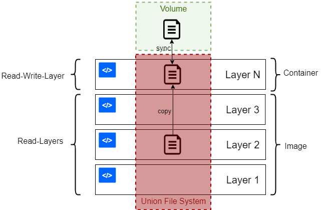

### Docker 

- Containerization using Docker

- Container Orchestration using Kubernetes


#### Virtual Machines

- It is called a Hardware level Virtualization.
- It is created using the Hypervisor
- It shares the underlying hardware configurations.
- It is used to run the Operating System.
- It consumes more space
- It requires considerable amount of time to start up.

#### Containers

- It is called a OS level Virtualization.
- It is created using the Container Engine
- It shares the underlying properties of OS.(Kernel - Control Groups & Namespaces)
- It is used to run the Application / Task. NOT Operating System.
- It doesn't consume more space
- It is faster in execution.
- If there is no Task / Application to Execute, the Containers will immediately go to exit state & Release the resources.

#### Containerization

**Infra-Structure Perspectives**

Using Containers we can reduce the number of Virtual Machines.


# Docker Engine overview

Docker Engine is an open source containerization technology for building and containerizing your applications. Docker Engine acts as a client-server application with:

1. A server with a long-running daemon process dockerd.
2. APIs which specify interfaces that programs can use to talk to and instruct the Docker daemon.
3. A command line interface (CLI) client docker.

The CLI uses Docker APIs to control or interact with the Docker daemon through scripting or direct CLI commands. 
The daemon creates and manage Docker objects, such as **images, containers, networks, and volumes**.

# Docker Volumes

By default all files created inside a container are stored on a writable container layer. This means that:

* The data doesn't persist when that container no longer exists, and it can be difficult to get the data out of the container if another process needs it.
* A container's writable layer is tightly coupled to the host machine where the container is running. You can't easily move the data somewhere else.
* Writing into a container's writable layer requires a storage driver to manage the filesystem. The storage driver provides a union filesystem, using the Linux kernel. This extra abstraction reduces performance as compared to using data volumes, which write directly to the host filesystem.





Volumes: Created and managed by Docker. You can create a volume explicitly using the following command

```
docker volume create
```

A given volume can be mounted into multiple containers simultaneously. When no running container is using a volume, the volume is still available to Docker and is not removed automatically. You can remove unused volumes using

```
docker volume prune
```

### Docker Bind Mounts

A Docker bind mount is a high-performance connection from the container to a directory on the host machine. It allows the host to share its own file system with the container, which can be made read-only or read-write.


### Docker Volumes

A bind mount uses the host file system, but Docker volumes are native to Docker. The data is kept somewhere on storage attached to the host – often the local filesystem. The volume itself has a lifecycle that’s longer than the container’s, allowing it to persist until no longer needed. Volumes can be shared between containers.

In some cases, the volume is in a form that is not usable by the host directly.

### Managing Volumes

Docker volumes are a way of storing data that can be shared across multiple containers. They are similar to files or directories on a file system, but they can be managed by Docker and can be easily shared among different containers. Docker volumes are used to store data that needs to persist between container restarts or that needs to be shared among different containers.

Docker volumes come in different types and can be managed using different methods. Some of the most commonly used Docker volume types are:

**Named volumes**: Named volumes are created and managed by Docker. They are stored in a directory on the host machine and can be easily accessed by multiple containers. Named volumes are created using the docker volume create command.

**Host volumes**: Host volumes are directories or files on the host machine that are mounted into a container. Host volumes are created using the docker run command with the -v flag.

**Anonymous volumes**: Anonymous volumes are created by Docker and are attached to a container when it is created. They are not named and cannot be reused. Anonymous volumes are created using the -v flag in the docker run command.

**Docker CLI Commands for Managing Volumes** options should be used


```
docker volume --help
docker volume [commnad] 
```

1. -v or –volume: It has three fields separated by (:).

2. The first field is the name of the volume and the second field is the path of the file or folder in the container where we are going to mount the volume, and the third one is optional that specify the access mode of the mounted file. We must follow the field order correctly in this option.


```
-v my-vol:/etc/:ro
```

In the above example, ‘my-vol’ is the name of the volume, and ‘/etc/’ is the folder inside the container, and access mode is read-only.

Lists all the volumes that are currently available on the host machine.

```
docker volume ls
```

Removes a named volume.

```
docker volume rm 
```

Provides detailed information about a named volume.

```
docker volume inspect
```

Mounts a named volume or a host directory or file into a container.

```
docker run --mount
```


# Docker same basic commands


```
docker --version
```

To get list of images on the docker

```
docker images
```

To get the list containers that are up and running

```
docker ps

``` 

To get the list of all containers which is running & exit/stopped state.

```
docker ps -a
``` 

Just download the image to local machine.

```
docker pull xxx  
``` 

The docker run command first creates a writeable container layer over the specified image, and then starts it using the specified command. That is, docker run is equivalent to the API /containers/create then /containers/(id)/start. A stopped container can be restarted with all its previous changes intact using docker start. See docker ps -a to view a list of all containers.

The docker run command can be used in combination with docker commit to change the command that a container runs. There is additional detailed information about docker run in the Docker run reference.

For information on connecting a container to a network, see the **Docker network overview**.

For example uses of this command, refer to the examples section below.

```
docker run [OPTIONS] IMAGE [COMMAND] [ARG...]
docker run
``` 

Run command execution mode :

1. Foreground/Attached Mode (Default)
2. Background/Detached Mode
3. Interactive Mode

**Docker Run Command**

This command will create a new container based on the Nginx image, start it, and map port 80 inside the container to port 8080 on the host.

```
docker run -p 8080:80 tomcat
``` 
**Setting Environment**

* it pulls the postgres Docker image from Docker Hub,
* sets the POSTGRES_PASSWORDenvironment variable value to postgres,
* names (--name) the Docker container to be postgres-docker ,
* maps container’s internal 5432 port to external 5432 port, so we’ll be able to enter it from outside,
* and enables to run the Docker container in the background (-d).

```
docker run --name postgres-docker -e POSTGRES_PASSWORD=postgres -p 5432:5432 -d postgres
``` 
just type this command in the terminal:

And with exec we’ve entered a postgres-docker image in detached mode -it and started to run it’s bash app (bash).
```
docker exec -it postgres-docker bash
```

**Mounting a Volume**

This command mounts a host directory ‘/host/directory’ to the container directory ‘/container/directory’ and runs a new container from the ‘busybox’ image. The ‘ls’ command is executed to list the contents of the container directory.

```
docker run -v /host/directory:/container/directory busybox ls /container/directory
``` 
**Running a Container in the Background**

The command docker run -d nginx starts a Docker container based on the official Nginx image in detached mode. The -d flag runs the container in the background and the nginx argument specifies the image name to use for the container. This command will pull the Nginx image from Docker Hub if it is not already present on your local machine, create a container based on that image, and start it in the background.

```
docker run -d nginx
``` 

**Options Available for executing Docker Run Command**

Some commonly used options for executing the docker run command inside container

**-it**  Runs the container in interactive mode, allowing you to interact with the container through the command line.

**-d** Runs the container in the background.

**–name** Specifies a name for the container.

**–rm** Automatically removes the container when it exits.

**-p** Maps a host port to a container port.

**-e** Sets an environment variable inside the container.

**-v** Mounts a host volume inside the container.


All **Docker containers** using the command Or list of all the containers only by their numeric ID's, run the command:

***
**Note:** If you are logged in as the sudo user, make sure to add the sudo prefix before both docker commands when stopping all containers ( sudo docker container stop $(sudo docker container ls -aq) ).
***

```
docker container ls -a
docker container ls -aq 
```

To stop a specific container, enter the following:

```
docker container stop [container_id]

```

To remove a stopped container, use the command:

```
docker container rm [container_id]
```

Remove All Stopped Containers

```
docker container rm $(docker container ls -aq)
```

# Docker Network