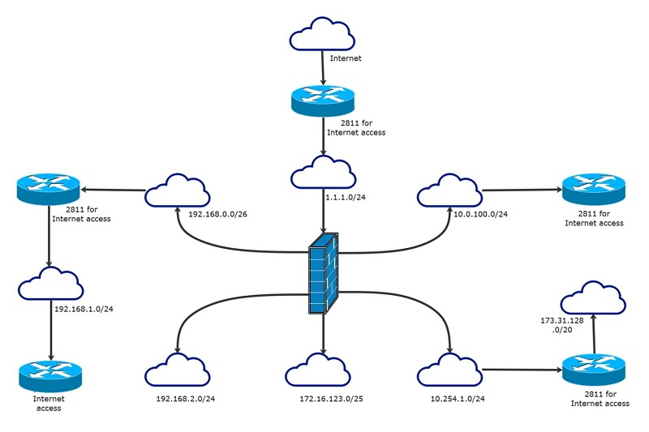
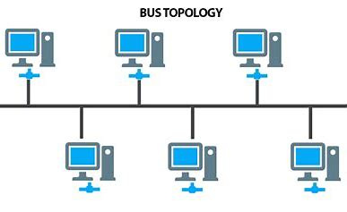
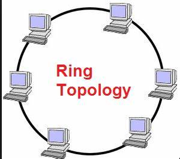
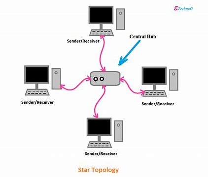
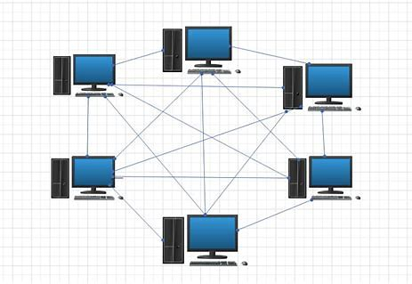

### Network Diagram

A network diagram is a visual representation of a computer or telecommunications network. It shows the components that make up a network and how they interact, including routers, devices, hubs, firewalls, etc.

#### Logical network diagrams

A logical network diagram describes the way information flows through a network. Therefore, logical network diagrams typically show subnets (including VLAN IDs, masks, and addresses), network devices like routers and firewalls, and routing protocols.

In the Open Systems Interconnection (OSI) model, logical network diagrams correlate with the information contained in layer 3 (L3). Also known as the “network layer,” L3 is an abstraction layer that deals with packet forwarding through intermediate routers. Level 2 shows the data links between adjacent nodes, while level 1 shows the purely physical layout.

####  Layers of the OSI model

The layers of the Open Systems Interconnection (OSI) model encapsulate every type of network communication across both software and hardware components. The model was designed to allow two standalone systems to communicate via standardised interfaces or protocols based on the current layer of operation.

#### Seven layers of the OSI model

**Physical layer:** The physical layer refers to the physical communication medium and the technologies to transmit data across that medium. At its core, data communication is the transfer of digital and electronic signals through various physical channels like fiber-optic cables, copper cabling, and air. The physical layer includes standards for technologies and metrics closely related with the channels, such as Bluetooth, NFC, and data transmission speeds.

**Data link layer:** The data link layer refers to the technologies used to connect two machines across a network where the physical layer already exists. It manages data frames, which are digital signals encapsulated into data packets. Flow control and error control of data are often key focuses of the data link layer. Ethernet is an example of a standard at this level. The data link layer is often split into two sub-layers: the Media Access Control (MAC) layer and Logical Link Control (LLC) layer. 

**Network layer:** The network layer is concerned with concepts such as routing, forwarding, and addressing across a dispersed network or multiple connected networks of nodes or machines. The network layer may also manage flow control. Across the internet, the Internet Protocol v4 (IPv4) and IPv6 are used as the main network layer protocols.

**Transport layer:** The primary focus of the transport layer is to ensure that data packets arrive in the right order, without losses or errors, or can be seamlessly recovered if required. Flow control, along with error control, is often a focus at the transport layer. At this layer, commonly used protocols include the Transmission Control Protocol (TCP), a near-lossless connection-based protocol, and the User Datagram Protocol (UDP), a lossy connectionless protocol. TCP is commonly used where all data must be intact (e.g. file share), whereas UDP is used when retaining all packets is less critical (e.g. video streaming).

**Session layer:** The session layer is responsible for network coordination between two separate applications in a session. A session manages the beginning and ending of a one-to-one application connection and synchronization conflicts. Network File System (NFS) and Server Message Block (SMB) are commonly used protocols at the session layer.

**Presentation layer:** The presentation layer is primarily concerned with the syntax of the data itself for applications to send and consume. For example, Hypertext Markup Language (HTML), JavaScipt Object Notation (JSON), and Comma Separated Values (CSV) are all modeling languages to describe the structure of data at the presentation layer. 

**Application layer:** The application layer is concerned with the specific type of application itself and its standardized communication methods. For example, browsers can communicate using HyperText Transfer Protocol Secure (HTTPS), and HTTP and email clients can communicate using POP3 (Post Office Protocol version 3) and SMTP (Simple Mail Transfer Protocol).

#### Physical network diagrams

A physical network diagram shows the actual physical arrangement of the components that make up the network, including cables and hardware. Typically, the diagram gives a bird’s eye view of the network in its physical space, like a floorplan.

#### Network topology

##### Bus topology

Bus topology is a type of network topology in which all devices are connected to a single cable called a "bus." This cable serves as a shared communication medium, allowing all devices on the network to receive the same signal simultaneously.

- Advantages of using bus topology
    * One advantage of using bus topology is that it is easy to install and requires less cable than other types of network topologies. 
    * Also, bus topology can be used to connect many devices, making it ideal for small to medium-sized networks.
- disadvantages of using bus topology
    * One major disadvantage of bus topology is that it is vulnerable to cable failures. If the bus cable is damaged or severed, the entire network will be affected. 
    * Additionally, bus topology is not well-suited for use in large networks, as the signal quality degrades over longer distances.

#####  Ring topology

Nodes are connected in a circular pattern, and packets of information are sent through the ring until they reach their destination.

Ring networks can outperform those based on the bus topology, and they can be easily reconfigured to add or remove devices. However, they are still relatively vulnerable, since the whole network fails if a single node fails. Also, bandwidth must be shared across all the devices and connections.

#####  Star topology

One of the most common topologies, the star topology consists of a central hub or switch, through which all of the data passes, along with all of the peripheral nodes connected to that central node.

Star topologies tend to be reliable because individual machines may crash without affecting the rest of the network. But if the central hub or switch fails, none of the connected nodes will be able to access it. Cable costs also tend to be higher for star networks.

###### Mesh topology

Mesh topology is a type of networking in which all the computers are inter-connected to each other. In Mesh Topology, the connections between devices take place randomly. The connected nodes can be computers, switches, hubs, or any other devices. In this topology setup, even if one of the connections goes down, it allows other nodes to be distributed. This type of topology is very expensive and does not have any hierarchy, interdependency, and uniform pattern between nodes. The connections of the mesh topology are not easier to establish.

### Virtual private network: 

allows users to access a private network over a public network as if they were directly connected to that private network

### Enterprise private network:

connects diverse elements within a business, such as multiple sites

### DSL network connectivity

shows how information is relayed over telephone lines

