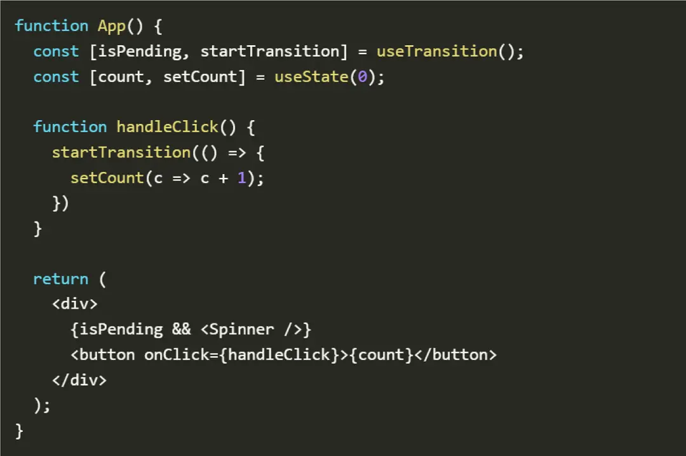
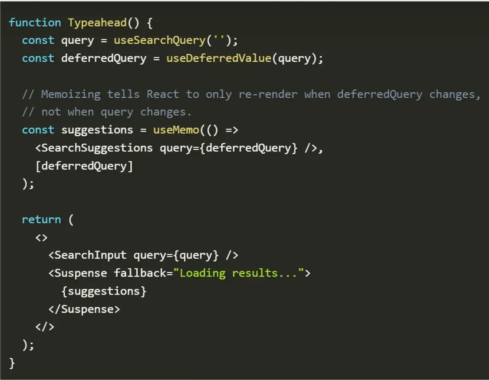
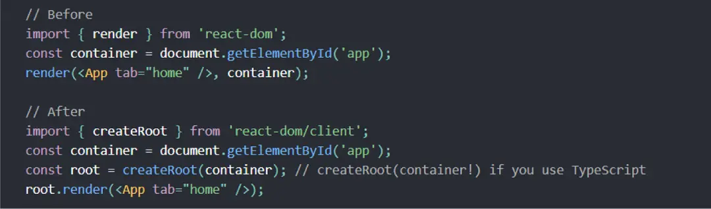

### React 18 New Features

* Concurrent Rendering
* Improvement in Automatic Batching
* New Start Transition API to Keep Your App Responsive
* New Suspense SSR, Architectural Improvements
* New APIs/Hooks startTransition(), useTransition(), useDeferredValue()
* IE11 No Longer Supported
* Update Client Rendering APIs 
* Update Server Rendering 

### Concurrent React
   
Solving a highly problematic concurrency issue. The concurrent react is a virtual element that eases the developers to have multiple instances of their UI, all at the same time.

Being a virtual assistant here means that the feature is not visible but coordinates with the backend processes to make it happen. It is a drastic change in React's rendering model, and hence, the developers must be familiar with how the Concurrent React works.

The reusable state is the handy feature that comes along the way with the Concurrent react. It can discard some UI sections and use them again after rolling to the previous model.

However, you can use this feature with an upcoming component named <OffScreen> which will further carry on the process.

### Improvement in Automatic Batching

React has an in-built batching feature that groups all the state updates through event handlers. It saves the files from undergoing an unnecessary rendering process. So, in addition to this, React 18 has an improvised form of Batching called React 18 Automatic Batching that batches all the state updates through createRoot.

The background of the updates is not necessary, and the process involves functions such as timeout and intervals, asynchronous applications, event handlers, and batch state updates.

```
setTimeout(() => {
    setCount(c => c + 1)
    setFlag(f => !f);
     // Component will be rendered twice in React 17, at React 18 render only once 
}, 1000);
```
### New Start Transition API to Keep Your App Responsive

Transition is a new feature introduced in the React 18's feature list. The developers can set a priority list based on the updates happening frequently. The essential updates occur with direct contacts such as a click, type, press, and other functions. These updates are carried out instantly as per the developer's requests.

#### Transition can be used in two ways

State Transition: It starts the transition when no opening hook is available.

User transition: It is used when a hook is already available and starts the transition update. The function saves a value to keep a check at the pending state.

### New Suspense SSR, Architectural Improvements
   
React suspense is a feature that allows the developers to keep an eye on the rendering components till the process continues. It has a fallback feature which is then displayed. With the latest React version, this feature can be combined with the transition API. It prevents the content from being replaced and even delays the rendering schedule to reduce the loading effect.

The react suspense is of great use as it offers a peaceful loading state till the time the user is experiencing a network clash.

### 5. New APIs/Hooks startTransition(), useTransition(), useDeferredValue()

React has some predefined hooks to perform a specific task as per the developer's request. Some of the latest introduced react hooks are as follows.

* startTransition()- It is an API used to determine the availability of a particular transition. This API refers to the state update that the developers want to operate. The updates wrapped up in the startTransition API are considered non-urgent updates. They can be overridden by urgent updates such as keypress, click, etc. A code snippet depicting the use case of the startTransition() API is shown below.

* useTransition()- It is used to create new state updates with priorities lower than the existing ones. It returns both the transition state and a function to initiate the start transition API. The use case of the useTransition() API is figured out below.




* useDeferredValue()- It is a hook that takes a value as a parameter and creates a duplicate copy of the same value. The new reference defers to an update that is more urgent than the previous one. Once the urgent updates are compiled, the new value is further rendered. We have an example shown below. 




### Update Client Rendering APIs

Users installing the react 18 for the first time are more likely to encounter warnings as ReactDOM.render feature no more exists in the latest update. The application process continues to function as per the last updated mode.

For example

The image below depicts a use case of both the before and after-effects of the changes made in the render feature.



The render function in React 17 is replaced with the createRoot feature through which the developers can render their HTML pages efficiently.

### Update Server Rendering

Server rendering deals with rendering the HTML files generated from a specific react component and sending them to the client. It works on the client-server architecture and represents a bridge between the two sides.

The old streaming APIs are deprecated, and the developers can use the latest introduced within the react 18 new features.

### IE11 No Longer Supported

React 18 does not support the IE11 feature and the developers switching to react 18 could no longer use it. So, if your project still works on the IE11 quality, you must not upgrade it to the latest version.

### How to Upgrade to React 18?

Upgrading the React 17 to its latest version entitles you to play around with the react 18 features, adding enhanced functionalities to your tasks. However, upgrading your react js is just a few steps away. It goes with some basic steps that can be performed within a few seconds.

Installing the latest version- Developers must follow this step to install the newest version for the react 18.
To install the latest version, type - npm install react@rc react-dom@rc
However, if you are using yarn, you must perform this operation- yarn add react@rc react-dom@rc
Once performed, the processor starts installing the related dependencies and other libraries to make it functional.

The upgraded version will provide you access to the newly introduced functionalities to build up a strong and attractive application using the react js. 

More details please refer as follows

https://www.knowledgehut.com/blog/web-development/react-18-new-features

Thanks Blog Author
Bala Krishna Ragala
Sep, 2023


#### React fetch and state management


```
import React, { useState, useEffect } from 'react';

const MyComponent = () => {
  const [data1, setData1] = useState(null);
  const [data2, setData2] = useState(null);

  useEffect(() => {
    Promise.all([
      fetch('/api/data1').then((response) => response.json()),
      fetch('/api/data2').then((response) => response.json())
    ])
      .then(([data1, data2]) => {
        setData1(data1);
        setData2(data2);
      })
      .catch((error) => {
        console.error('Error fetching data:', error);
      });
  }, []);

  return data1 && data2 ? (
    <div>
      {data1}
      {data2}
    </div>
  ) : (
    <div>Loading...</div>
  );
};

export default MyComponent;
```