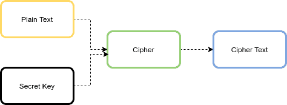

### AES Algorithm

The symmetric-key block cipher plays an important role in data encryption. It means that the same key is used for both encryption and decryption. The Advanced Encryption Standard (AES) is a widely used symmetric-key encryption algorithm.


The AES algorithm is an iterative, symmetric-key block cipher that supports cryptographic keys (secret keys) of 128, 192, and 256 bits to encrypt and decrypt data in blocks of 128 bits. 



If the data to be encrypted doesn’t meet the block size requirement of 128 bits, it must be padded. Padding is the process of filling up the last block to 128 bits.

#### AES Variations

The AES algorithm has six modes of operation. the mode of operation in order to strengthen the effect of the encryption algorithm.

1. ECB (Electronic Code Book)
2. CBC (Cipher Block Chaining)
3. CFB (Cipher FeedBack)
4. OFB (Output FeedBack)
5. CTR (Counter)
6. GCM (Galois/Counter Mode)


**ECB** : This mode of operation is the simplest of all. The plaintext is divided into blocks with a size of 128 bits. Then each block is encrypted with the same key and algorithm. Therefore, it produces the same result for the same block. This is the main weakness of this mode, and it’s not recommended for encryption.


**CBC** : In order to overcome the ECB weakness, CBC mode uses an Initialization Vector (IV) to augment the encryption. First, CBC uses the plaintext block xor with the IV. Then it encrypts the result to the ciphertext block. 

**CFB** : This mode can be used as a stream cipher. First, it encrypts the IV, then it will xor with the plaintext block to get ciphertext. Then CFB encrypts the encryption result to xor the plaintext. It needs an IV.

**CTR** : This mode uses the value of a counter as an IV. It’s very similar to OFB, but it uses the counter to be encrypted every time instead of the IV. This mode has two strengths, including encryption/decryption parallelization, and noise in one block does not affect other blocks.

**GCM** : This mode is an extension of the CTR mode. The GCM has received significant attention and is recommended by NIST. The GCM model outputs ciphertext and an authentication tag. The main advantage of this mode, compared to other operation modes of the algorithm, is its efficiency.


#### Size of Data After Encryption

As mentioned earlier, the AES has a block size of 128 bits or 16 bytes. The AES doesn’t change the size, and the ciphertext size is equal to the cleartext size. Also, in ECB and CBC modes, we should use a padding algorithm like PKCS 5. So the size of data after encryption is:

```
ciphertext_size (bytes) = cleartext_size + (16 - (cleartext_size % 16))
```
For storing IV with ciphertext, we need to add 16 more bytes.

### AES/CBC/PKCS5Padding algorithm


#### AES Parameters

In the AES algorithm, we need three parameters: input data, secret key, and IV. IV is not used in ECB mode.


**Input Data** : The input data to the AES can be string, file, object, and password-based.

**Secret Key** : There are two ways for generating a secret key in the AES: generating from a random number, or deriving from a given password.

**Note**: In the first approach, the secret key should be generated from a Cryptographically Secure (Pseudo-)Random Number Generator like the SecureRandom class.

For generating a secret key, we can use the KeyGenerator class. Let’s define a method for generating the AES key with the size of n (128, 192, and 256) bits:


```
public static SecretKey generateKey(int n) throws NoSuchAlgorithmException {
    KeyGenerator keyGenerator = KeyGenerator.getInstance("AES");
    keyGenerator.init(n);
    SecretKey key = keyGenerator.generateKey();
    return key;
}

```

In the second approach, the AES secret key can be derived from a given password using a password-based key derivation function like PBKDF2. We also need a salt value for turning a password into a secret key. The salt is also a random value.

We can use the SecretKeyFactory class with the PBKDF2WithHmacSHA256 algorithm for generating a key from a given password.

Let’s define a method for generating the AES key from a given password with 65,536 iterations and a key length of 256 bits:


```
public static SecretKey getKeyFromPassword(String password, String salt)
    throws NoSuchAlgorithmException, InvalidKeySpecException {
    
    SecretKeyFactory factory = SecretKeyFactory.getInstance("PBKDF2WithHmacSHA256");
    KeySpec spec = new PBEKeySpec(password.toCharArray(), salt.getBytes(), 65536, 256);
    SecretKey secret = new SecretKeySpec(factory.generateSecret(spec)
        .getEncoded(), "AES");
    return secret;
}
```


#### Initialization Vector (IV)

IV is a pseudo-random value and has the same size as the block that is encrypted. We can use the SecureRandom class to generate a random IV.

```
public static IvParameterSpec generateIv() {
    byte[] iv = new byte[16];
    new SecureRandom().nextBytes(iv);
    return new IvParameterSpec(iv);
}
```

To implement input string encryption, we first need to generate the secret key and IV according to the previous section.

```
public static String encrypt(String algorithm, String input, SecretKey key,
    IvParameterSpec iv) throws NoSuchPaddingException, NoSuchAlgorithmException,
    InvalidAlgorithmParameterException, InvalidKeyException,
    BadPaddingException, IllegalBlockSizeException {
    
    Cipher cipher = Cipher.getInstance(algorithm);
    cipher.init(Cipher.ENCRYPT_MODE, key, iv);
    byte[] cipherText = cipher.doFinal(input.getBytes());
    return Base64.getEncoder()
        .encodeToString(cipherText);
}
```
For ecrypting an input string, we can initialize our cipher using the DECRYPT_MODE to decrypt the content:

```
public static String decrypt(String algorithm, String cipherText, SecretKey key,
    IvParameterSpec iv) throws NoSuchPaddingException, NoSuchAlgorithmException,
    InvalidAlgorithmParameterException, InvalidKeyException,
    BadPaddingException, IllegalBlockSizeException {
    
    Cipher cipher = Cipher.getInstance(algorithm);
    cipher.init(Cipher.DECRYPT_MODE, key, iv);
    byte[] plainText = cipher.doFinal(Base64.getDecoder()
        .decode(cipherText));
    return new String(plainText);
}
```

Let’s write a test method for encrypting and decrypting a string input:

```
@Test
void givenString_whenEncrypt_thenSuccess()
    throws NoSuchAlgorithmException, IllegalBlockSizeException, InvalidKeyException,
    BadPaddingException, InvalidAlgorithmParameterException, NoSuchPaddingException { 
    
    String input = "baeldung";
    SecretKey key = AESUtil.generateKey(128);
    IvParameterSpec ivParameterSpec = AESUtil.generateIv();
    String algorithm = "AES/CBC/PKCS5Padding";
    String cipherText = AESUtil.encrypt(algorithm, input, key, ivParameterSpec);
    String plainText = AESUtil.decrypt(algorithm, cipherText, key, ivParameterSpec);
    Assertions.assertEquals(input, plainText);
}
```


