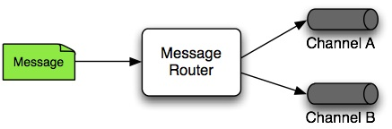
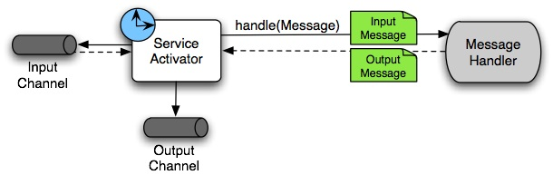
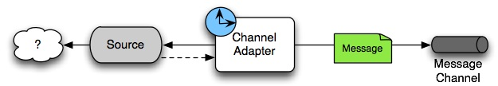
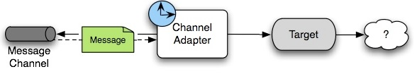

###  Spring Framework

Spring Framework is a Java platform that provides comprehensive infrastructure support for developing Java applications. Spring handles the infrastructure so you can focus on your application.

Spring Frameworks **layered architecture**, you can use what you need and leave which you don’t.

**Inversion of control** (IOC): The objects give their dependencies instead of creating or looking for dependent objects. This is called Inversion Of Control.

**Aspect oriented Programming** (AOP): Aspect oriented programming in Spring supports cohesive development by separating application business logic from system services.

**Container**: Spring Framework creates and manages the life cycle and configuration of the application objects.

Support **SpEL** (Spring Expression Language)

## What Spring can do?

#### Microservices

Microservice architectures are the ‘new normal’. Building small, self-contained, ready to run applications can bring great flexibility and added resilience to your code.

Resilience: Resilience is the process and outcome of successfully adapting to difficult or challenging life experiences,

#### Modules

The Spring Framework consists of features organized into about 20 modules, These modules are grouped into Core Container,

#### Core Container

The Core Container consists of the Core, Beans, Context, and Expression Language modules.

The **Core and Beans** modules provide the fundamental parts of the framework, including the IoC and Dependency Injection features.

The **Context module** builds on the solid base provided by the Core and Beans modules: it is a means to access objects in a framework-style manner that is similar to a JNDI registry.

The **Context module** inherits its features from the Beans module and adds support for internationalization (using, for example, resource bundles), event-propagation, resource-loading, and the transparent creation of contexts by, for example, a servlet container.

#### Data Access/Integration

The Data Access/Integration layer consists of the JDBC, ORM, OXM, JMS and Transaction modules.

* Java database connectivity (JDBC)
* Object Relational Mapping (ORM) 
* Marshalling XML using O/X Mappers ( OXM)
* Java Messaging Service (JMS)
* The Transaction module supports programmatic and declarative transaction management

#### Web

The Web layer consists of the Web, Web-Servlet, Web-Struts, and Web-Portlet modules.

#### AOP and Instrumentation

Aspect Oriented Programming with Spring, 

AOP the unit of modularity is the aspect. Aspects enable the modularization of concerns such as transaction management that cut across multiple types and objects.

One of the key components of Spring is the AOP framework. While the Spring IoC container does not depend on AOP, meaning you do not need to use AOP if you don't want to, AOP complements Spring IoC to provide a very capable middleware solution.

**AOP concepts**

* Aspect: a modularization of a concern that cuts across multiple classes. Transaction management is a good example of a crosscutting concern in enterprise Java applications. In Spring AOP, aspects are implemented using regular classes (the schema-based approach) or regular classes annotated with the @Aspect annotation (the @AspectJ style).

* Join point: a point during the execution of a program, such as the execution of a method or the handling of an exception. In Spring AOP, a join point always represents a method execution.

* Advice: action taken by an aspect at a particular join point. Different types of advice include "around," "before" and "after" advice. (Advice types are discussed below.) Many AOP frameworks, including Spring, model an advice as an interceptor, maintaining a chain of interceptors around the join point.

* Pointcut: a predicate that matches join points. Advice is associated with a pointcut expression and runs at any join point matched by the pointcut (for example, the execution of a method with a certain name). The concept of join points as matched by pointcut expressions is central to AOP, and Spring uses the AspectJ pointcut expression language by default.

* Introduction: declaring additional methods or fields on behalf of a type. Spring AOP allows you to introduce new interfaces (and a corresponding implementation) to any advised object. For example, you could use an introduction to make a bean implement an IsModified interface, to simplify caching. (An introduction is known as an inter-type declaration in the AspectJ community.)

* Target object: object being advised by one or more aspects. Also referred to as the advised object. Since Spring AOP is implemented using runtime proxies, this object will always be a proxied object.

* AOP proxy: an object created by the AOP framework in order to implement the aspect contracts (advise method executions and so on). In the Spring Framework, an AOP proxy will be a JDK dynamic proxy or a CGLIB proxy.

* Weaving: linking aspects with other application types or objects to create an advised object. This can be done at compile time (using the AspectJ compiler, for example), load time, or at runtime. Spring AOP, like other pure Java AOP frameworks, performs weaving at runtime.

#### Test

JUnit: The de-facto standard for unit testing Java applications.

### The IoC Container

#### Container Overview

The **org.springframework.beans** and **org.springframework.context** packages are the basis for Spring Framework’s IoC container.

In short, the BeanFactory provides the configuration framework and basic functionality, and the ApplicationContext adds more enterprise-specific functionality. The ApplicationContext is a complete superset of the BeanFactory and is used exclusively in this chapter in descriptions of Spring’s IoC container.

In Spring, the objects that form the backbone of your application and that are managed by the Spring IoC container are called beans.

A bean is an object that is instantiated, assembled, and managed by a Spring IoC container. Otherwise, a bean is simply one of many objects in your application. Beans, and the dependencies among them, are reflected in the configuration metadata used by a container.

Several implementations of the **ApplicationContext** interface are supplied with Spring. In stand-alone applications, it is common to create an instance of ClassPathXmlApplicationContext or FileSystemXmlApplicationContext

#### Configuration Metadata

This configuration metadata represents how you, as an application developer, tell the Spring container to instantiate, configure, and assemble the objects in your application.

### Bean Overview

A Spring IoC container manages one or more beans. These beans are created with the configuration metadata that you supply to the container

Bean behavioral configuration elements, which state how the bean should behave in the container (scope, lifecycle callbacks, and so forth).

**Bean Scopes**: singleton, prototype, request, session, application, websocket

A thread scope is available but is not registered by default.

* Dependencies
* Bean Scopes
* Customizing the Nature of a Bean
* Bean Definition Inheritance
* Container Extension Points
* Annotation-based Container Configuration
* Classpath Scanning and Managed Components
* Using JSR 330 Standard Annotations
* Java-based Container Configuration
* Environment Abstraction
* Registering a LoadTimeWeaver
* Additional Capabilities of the ApplicationContext
* The BeanFactory API

### Spring Integration 

https://docs.spring.io/spring-integration/reference/

#### Compatible Java Versions

Spring Integration 6.3.x, the minimum compatible Java version is Java SE 17. Older versions of Java are not supported.

#### Overview of Spring Integration Framework

It enables lightweight messaging within Spring-based applications and supports integration with external systems through declarative adapters. Those adapters provide a higher level of abstraction over Spring’s support for remoting, messaging, and scheduling.

#### Goals and Principles

##### Spring Integration is motivated by the following goals

1. Provide a simple model for implementing complex enterprise integration solutions.
2. Facilitate asynchronous, message-driven behavior within a Spring-based application.
3. Promote intuitive, incremental adoption for existing Spring users.

##### Spring Integration is guided by the following principles

1. Components should be loosely coupled for modularity and testability.
2. The framework should enforce separation of concerns between business logic and integration logic.
3. Extension points should be abstract in nature (but within well-defined boundaries) to promote reuse and portability.

##### Message

In Spring Integration, a message is a generic wrapper for any Java object combined with metadata used by the framework while handling that object. It consists of a payload and headers.

##### Message Channel

A message channel represents the "pipe" of a pipes-and-filters architecture. Producers send messages to a channel, and consumers receive messages from a channel. The message channel therefore decouples the messaging components and also provides a convenient point for interception and monitoring of messages.

A message channel may follow either point-to-point or publish-subscribe semantics. With a point-to-point channel, no more than one consumer can receive each message sent to the channel. Publish-subscribe channels, on the other hand, attempt to broadcast each message to all subscribers on the channel. Spring Integration supports both of these models.

##### Message Endpoint

The components responsible for these connections are message endpoints. 

Any real-world enterprise integration solution requires some amount of code focused upon integration concerns such as routing and transformation. The important thing is to achieve separation of concerns between the integration logic and the business logic.

##### Message Endpoints

A Message Endpoint represents the "filter" of a pipes-and-filters architecture.
the application code should ideally have no awareness of the message objects or the message channels. This is similar to the role of a controller in the MVC paradigm. 

Just as a controller handles HTTP requests, the message endpoint handles messages. Just as controllers are mapped to URL patterns, message endpoints are mapped to message channels. 

Spring integration provide only a high-level description of the main endpoint types supported by Spring Integration and the roles associated with those types.

#### Message Transformer

A message transformer is responsible for converting a message’s content or structure and returning the modified message. Probably the most common type of transformer is one that converts the payload of the message from one format to another (such as from XML to java.lang.String). 

#### Message Filter

A message filter determines whether a message should be passed to an output channel at all. This simply requires a boolean test method that may check for a particular payload content type, a property value, the presence of a header, or other conditions. If the message is accepted, it is sent to the output channel. If not, it is dropped (or, for a more severe implementation, an Exception could be thrown). 

Message filters are often used in conjunction with a publish-subscribe channel, where multiple consumers may receive the same message and use the criteria of the filter to narrow down the set of messages to be processed.

**Note:** Be careful not to confuse the generic use of “filter” within the pipes-and-filters architectural pattern with this specific endpoint type that selectively narrows down the messages flowing between two channels. The pipes-and-filters concept of a “filter” matches more closely with Spring Integration’s message endpoint: any component that can be connected to a message channel in order to send or receive messages. 

#### Message Router

A message router is responsible for deciding what channel or channels (if any) should receive the message next. Typically, the decision is based upon the message’s content or the metadata available in the message headers. A message router is often used as a dynamic alternative to a statically configured output channel on a service activator or other endpoint capable of sending reply messages. Likewise, a message router provides a proactive alternative to the reactive message filters used by multiple subscribers, as described earlier.

#### Splitter

A splitter is another type of message endpoint whose responsibility is to accept a message from its input channel, split that message into multiple messages, and send each of those to its output channel. This is typically used for dividing a “composite” payload object into a group of messages containing the subdivided payloads.

#### Aggregator

Basically a mirror-image of the splitter, the aggregator is a type of message endpoint that receives multiple messages and combines them into a single message. In fact, aggregators are often downstream consumers in a pipeline that includes a splitter. Technically, the aggregator is more complex than a splitter, because it is required to maintain state (the messages to be aggregated), to decide when the complete group of messages is available, and to timeout if necessary. Furthermore, in case of a timeout, the aggregator needs to know whether to send the partial results, discard them, or send them to a separate channel. Spring Integration provides a CorrelationStrategy, a ReleaseStrategy, and configurable settings for timeout, whether to send partial results upon timeout, and a discard channel.

#### Service Activator

A Service Activator is a generic endpoint for connecting a service instance to the messaging system. The input message channel must be configured, and, if the service method to be invoked is capable of returning a value, an output message Channel may also be provided.

**Note:** The output channel is optional, since each message may also provide its own 'Return Address' header. This same rule applies for all consumer endpoints.

The service activator invokes an operation on some service object to process the request message, extracting the request message’s payload and converting (if the method does not expect a message-typed parameter). Whenever the service object’s method returns a value, that return value is likewise converted to a reply message if necessary (if it is not already a message type). That reply message is sent to the output channel. If no output channel has been configured, the reply is sent to the channel specified in the message’s “return address”, if available.

A request-reply service activator endpoint connects a target object’s method to input and output Message Channels.

**Note:** As discussed earlier, in Message Channel, channels can be pollable or subscribable. In the preceding diagram, this is depicted by the “clock” symbol and the solid arrow (poll) and the dotted arrow (subscribe).

#### Channel Adapter

A channel adapter is an endpoint that connects a message channel to some other system or transport. Channel adapters may be either inbound or outbound. Typically, the channel adapter does some mapping between the message and whatever object or resource is received from or sent to the other system (file, HTTP Request, JMS message, and others). Depending on the transport, the channel adapter may also populate or extract message header values.

An inbound channel adapter endpoint connects a source system to a MessageChannel.

**Note:** Message sources can be pollable (for example, POP3) or message-driven (for example, IMAP Idle). In the preceding diagram, this is depicted by the “clock” symbol and the solid arrow (poll) and the dotted arrow (message-driven).

An outbound channel adapter endpoint connects a MessageChannel to a target system.

**Note:** As discussed earlier in Message Channel, channels can be pollable or subscribable. In the preceding diagram, this is depicted by the “clock” symbol and the solid arrow (poll) and the dotted arrow (subscribe). 

