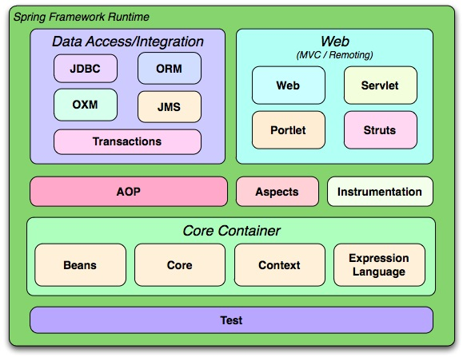
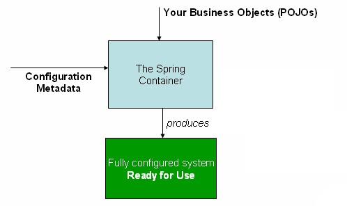

###  Spring Framework

Spring Framework is a Java platform that provides comprehensive infrastructure support for developing Java applications. Spring handles the infrastructure so you can focus on your application.

Spring Frameworks **layered architecture**, you can use what you need and leave which you don’t.

**Inversion of control** (IOC): The objects give their dependencies instead of creating or looking for dependent objects. This is called Inversion Of Control.

**Aspect oriented Programming** (AOP): Aspect oriented programming in Spring supports cohesive development by separating application business logic from system services.

**Container**: Spring Framework creates and manages the life cycle and configuration of the application objects.

Support **SpEL** (Spring Expression Language)

## What Spring can do?

#### Microservices

Microservice architectures are the ‘new normal’. Building small, self-contained, ready to run applications can bring great flexibility and added resilience to your code.

Resilience: Resilience is the process and outcome of successfully adapting to difficult or challenging life experiences,

#### Modules

The Spring Framework consists of features organized into about 20 modules, These modules are grouped into Core Container,

#### Core Container

The Core Container consists of the Core, Beans, Context, and Expression Language modules.

The **Core and Beans** modules provide the fundamental parts of the framework, including the IoC and Dependency Injection features.

The **Context module** builds on the solid base provided by the Core and Beans modules: it is a means to access objects in a framework-style manner that is similar to a JNDI registry.

The **Context module** inherits its features from the Beans module and adds support for internationalization (using, for example, resource bundles), event-propagation, resource-loading, and the transparent creation of contexts by, for example, a servlet container.

#### Data Access/Integration

The Data Access/Integration layer consists of the JDBC, ORM, OXM, JMS and Transaction modules.

* Java database connectivity (JDBC)
* Object Relational Mapping (ORM) 
* Marshalling XML using O/X Mappers ( OXM)
* Java Messaging Service (JMS)
* The Transaction module supports programmatic and declarative transaction management

#### Web

The Web layer consists of the Web, Web-Servlet, Web-Struts, and Web-Portlet modules.

#### AOP and Instrumentation

Aspect Oriented Programming with Spring, 

AOP the unit of modularity is the aspect. Aspects enable the modularization of concerns such as transaction management that cut across multiple types and objects.

One of the key components of Spring is the AOP framework. While the Spring IoC container does not depend on AOP, meaning you do not need to use AOP if you don't want to, AOP complements Spring IoC to provide a very capable middleware solution.

**AOP concepts**

* Aspect: a modularization of a concern that cuts across multiple classes. Transaction management is a good example of a crosscutting concern in enterprise Java applications. In Spring AOP, aspects are implemented using regular classes (the schema-based approach) or regular classes annotated with the @Aspect annotation (the @AspectJ style).

* Join point: a point during the execution of a program, such as the execution of a method or the handling of an exception. In Spring AOP, a join point always represents a method execution.

* Advice: action taken by an aspect at a particular join point. Different types of advice include "around," "before" and "after" advice. (Advice types are discussed below.) Many AOP frameworks, including Spring, model an advice as an interceptor, maintaining a chain of interceptors around the join point.

* Pointcut: a predicate that matches join points. Advice is associated with a pointcut expression and runs at any join point matched by the pointcut (for example, the execution of a method with a certain name). The concept of join points as matched by pointcut expressions is central to AOP, and Spring uses the AspectJ pointcut expression language by default.

* Introduction: declaring additional methods or fields on behalf of a type. Spring AOP allows you to introduce new interfaces (and a corresponding implementation) to any advised object. For example, you could use an introduction to make a bean implement an IsModified interface, to simplify caching. (An introduction is known as an inter-type declaration in the AspectJ community.)

* Target object: object being advised by one or more aspects. Also referred to as the advised object. Since Spring AOP is implemented using runtime proxies, this object will always be a proxied object.

* AOP proxy: an object created by the AOP framework in order to implement the aspect contracts (advise method executions and so on). In the Spring Framework, an AOP proxy will be a JDK dynamic proxy or a CGLIB proxy.

* Weaving: linking aspects with other application types or objects to create an advised object. This can be done at compile time (using the AspectJ compiler, for example), load time, or at runtime. Spring AOP, like other pure Java AOP frameworks, performs weaving at runtime.

#### Test

JUnit: The de-facto standard for unit testing Java applications.

### The IoC Container

#### Container Overview

The **org.springframework.beans** and **org.springframework.context** packages are the basis for Spring Framework’s IoC container.

In short, the BeanFactory provides the configuration framework and basic functionality, and the ApplicationContext adds more enterprise-specific functionality. The ApplicationContext is a complete superset of the BeanFactory and is used exclusively in this chapter in descriptions of Spring’s IoC container.

In Spring, the objects that form the backbone of your application and that are managed by the Spring IoC container are called beans.

A bean is an object that is instantiated, assembled, and managed by a Spring IoC container. Otherwise, a bean is simply one of many objects in your application. Beans, and the dependencies among them, are reflected in the configuration metadata used by a container.

Several implementations of the **ApplicationContext** interface are supplied with Spring. In stand-alone applications, it is common to create an instance of ClassPathXmlApplicationContext or FileSystemXmlApplicationContext

#### Configuration Metadata

This configuration metadata represents how you, as an application developer, tell the Spring container to instantiate, configure, and assemble the objects in your application.

### Bean Overview

A Spring IoC container manages one or more beans. These beans are created with the configuration metadata that you supply to the container

Bean behavioral configuration elements, which state how the bean should behave in the container (scope, lifecycle callbacks, and so forth).

**Bean Scopes**: singleton, prototype, request, session, application, websocket

A thread scope is available but is not registered by default.

* Dependencies
* Bean Scopes
* Customizing the Nature of a Bean
* Bean Definition Inheritance
* Container Extension Points
* Annotation-based Container Configuration
* Classpath Scanning and Managed Components
* Using JSR 330 Standard Annotations
* Java-based Container Configuration
* Environment Abstraction
* Registering a LoadTimeWeaver
* Additional Capabilities of the ApplicationContext
* The BeanFactory API

