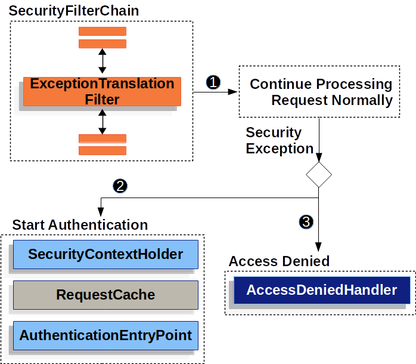

### Spring Security

Spring Security is a framework that provides authentication, authorization, and protection against common attacks.

#### Architecture

Spring Security’s high-level architecture within Servlet based applications. We build on this high-level understanding within the Authentication, Authorization, and Protection Against Exploits sections of the reference


##### DelegatingFilterProxy

Spring provides a Filter implementation named DelegatingFilterProxy that allows bridging between the Servlet container’s lifecycle and Spring’s ApplicationContext

The Servlet container allows registering Filter instances by using its own standards, but it is not aware of Spring-defined Beans.

You can register DelegatingFilterProxy through the standard Servlet container mechanisms but delegate all the work to a Spring Bean that implements Filter.


DelegatingFilterProxy looks up Bean Filter0 from the ApplicationContext and then invokes Bean Filter0. The following listing shows pseudo code of DelegatingFilterProxy:

```
public void doFilter(ServletRequest request, ServletResponse response, FilterChain chain) {
	Filter delegate = getFilterBean(someBeanName); 
	delegate.doFilter(request, response); 
}
```

1. Lazily get Filter that was registered as a Spring Bean. For the example in DelegatingFilterProxy delegate is an instance of Bean Filter0.
2. Delegate work to the Spring Bean.

##### FilterChainProxy

Spring Security’s Servlet support is contained within FilterChainProxy. FilterChainProxy is a special Filter provided by Spring Security that allows delegating to many Filter instances through SecurityFilterChain. Since FilterChainProxy is a Bean, it is typically wrapped in a DelegatingFilterProxy.


##### SecurityFilterChain

SecurityFilterChain is used by FilterChainProxy to determine which Spring Security Filter instances should be invoked for the current request.


The Security Filters in SecurityFilterChain are typically Beans, but they are registered with FilterChainProxy instead of DelegatingFilterProxy. FilterChainProxy provides a number of advantages to registering directly with the Servlet container or DelegatingFilterProxy. First, it provides a starting point for all of Spring Security’s Servlet support. For that reason, if you try to troubleshoot Spring Security’s Servlet support, adding a debug point in FilterChainProxy is a great place to start.

Second, since FilterChainProxy is central to Spring Security usage, it can perform tasks that are not viewed as optional. For example, it clears out the SecurityContext to avoid memory leaks. It also applies Spring Security’s HttpFirewall to protect applications against certain types of attacks.


#### Security Filters

The Security Filters are inserted into the FilterChainProxy with the SecurityFilterChain API. Those filters can be used for a number of different purposes, like authentication, authorization, exploit protection, and more. The filters are executed in a specific order to guarantee that they are invoked at the right time, for example, the Filter that performs authentication should be invoked before the Filter that performs authorization. It is typically not necessary to know the ordering of Spring Security’s Filters. However, there are times that it is beneficial to know the ordering, if you want to know them, you can check the FilterOrderRegistration code.

```
@Configuration
@EnableWebSecurity
public class SecurityConfig {

    @Bean
    public SecurityFilterChain filterChain(HttpSecurity http) throws Exception {
        http
            .csrf(Customizer.withDefaults())
            .authorizeHttpRequests(authorize -> authorize
                .anyRequest().authenticated()
            )
            .httpBasic(Customizer.withDefaults())
            .formLogin(Customizer.withDefaults());
        return http.build();
    }

}
```

<table>
<tr>
<th>
Filter
</th>
<th>
Added by
</th>
</tr>
<tr>
<td>
CsrfFilter
</td>
<td>
HttpSecurity#csrf
</td>
</tr>
<tr>
<td>
UsernamePasswordAuthenticationFilter
</td>
<td>
HttpSecurity#formLogin
</td>
</tr>
<tr>
<td>
BasicAuthenticationFilter
</td>
<td>
HttpSecurity#httpBasic
</td>
</tr>
<tr>
<td>
AuthorizationFilter
</td>
<td>
HttpSecurity#authorizeHttpRequests
</td>
</tr>
</table>

1. First, the CsrfFilter is invoked to protect against CSRF attacks.

2. Second, the authentication filters are invoked to authenticate the request.

3. Third, the AuthorizationFilter is invoked to authorize the request.

Security Filters list

```
2023-06-14T08:55:22.321-03:00  INFO 76975 --- [           main] o.s.s.web.DefaultSecurityFilterChain     : Will secure any request with [
org.springframework.security.web.session.DisableEncodeUrlFilter@404db674,
org.springframework.security.web.context.request.async.WebAsyncManagerIntegrationFilter@50f097b5,
org.springframework.security.web.context.SecurityContextHolderFilter@6fc6deb7,
org.springframework.security.web.header.HeaderWriterFilter@6f76c2cc,
org.springframework.security.web.csrf.CsrfFilter@c29fe36,
org.springframework.security.web.authentication.logout.LogoutFilter@ef60710,
org.springframework.security.web.authentication.UsernamePasswordAuthenticationFilter@7c2dfa2,
org.springframework.security.web.authentication.ui.DefaultLoginPageGeneratingFilter@4397a639,
org.springframework.security.web.authentication.ui.DefaultLogoutPageGeneratingFilter@7add838c,
org.springframework.security.web.authentication.www.BasicAuthenticationFilter@5cc9d3d0,
org.springframework.security.web.savedrequest.RequestCacheAwareFilter@7da39774,
org.springframework.security.web.servletapi.SecurityContextHolderAwareRequestFilter@32b0876c,
org.springframework.security.web.authentication.AnonymousAuthenticationFilter@3662bdff,
org.springframework.security.web.access.ExceptionTranslationFilter@77681ce4,
org.springframework.security.web.access.intercept.AuthorizationFilter@169268a7]
```

#### Adding a Custom Filter to the Filter Chain

```
public class TenantFilter implements Filter {

    @Override
    public void doFilter(ServletRequest servletRequest, ServletResponse servletResponse, FilterChain filterChain) throws IOException, ServletException {
        HttpServletRequest request = (HttpServletRequest) servletRequest;
        HttpServletResponse response = (HttpServletResponse) servletResponse;

        String tenantId = request.getHeader("X-Tenant-Id"); // 1
        boolean hasAccess = isUserAllowed(tenantId); // 2
        if (hasAccess) {
            filterChain.doFilter(request, response); // 3
            return;
        }
        throw new AccessDeniedException("Access denied"); // 4 
    }

}
```


1. Get the tenant id from the request header.
2. Check if the current user has access to the tenant id.
3. If the user has access, then invoke the rest of the filters in the chain.
4. If the user does not have access, then throw an AccessDeniedException.


Instead of implementing Filter, you can extend from OncePerRequestFilter which is a base class for filters that are only invoked once per request and provides a doFilterInternal method with the HttpServletRequest and HttpServletResponse parameters.

```
@Bean
SecurityFilterChain filterChain(HttpSecurity http) throws Exception {
    http
        // ...
        .addFilterBefore(new TenantFilter(), AuthorizationFilter.class); // 1
    return http.build();
}
```

1. Use HttpSecurity#addFilterBefore to add the TenantFilter before the AuthorizationFilter.


By adding the filter before the AuthorizationFilter we are making sure that the TenantFilter is invoked after the authentication filters. You can also use HttpSecurity#addFilterAfter to add the filter after a particular filter or HttpSecurity#addFilterAt to add the filter at a particular filter position in the filter chain.
And that’s it, now the TenantFilter will be invoked in the filter chain and will check if the current user has access to the tenant id.

#### Handling Security Exceptions

ExceptionTranslationFilter is inserted into the FilterChainProxy as one of the Security Filters.



number 1 First, the ExceptionTranslationFilter invokes FilterChain.doFilter(request, response) to invoke the rest of the application.

number 2 If the user is not authenticated or it is an AuthenticationException, then Start Authentication.

The SecurityContextHolder is cleared out.

The HttpServletRequest is saved so that it can be used to replay the original request once authentication is successful.

The AuthenticationEntryPoint is used to request credentials from the client. For example, it might redirect to a log in page or send a WWW-Authenticate header.

number 3 Otherwise, if it is an AccessDeniedException, then Access Denied. The AccessDeniedHandler is invoked to handle access denied.


**Note:** If the application does not throw an AccessDeniedException or an AuthenticationException, then ExceptionTranslationFilter does not do anything.

```
try {
	filterChain.doFilter(request, response); // 1
} catch (AccessDeniedException | AuthenticationException ex) {
	if (!authenticated || ex instanceof AuthenticationException) {
		startAuthentication(); // 2
	} else {
		accessDenied(); // 3
	}
}
```

1. As described in A Review of Filters, invoking FilterChain.doFilter(request, response) is the equivalent of invoking the rest of the application. This means that if another part of the application, (FilterSecurityInterceptor or method security) throws an AuthenticationException or AccessDeniedException it is caught and handled here.
2. If the user is not authenticated or it is an AuthenticationException, Start Authentication.
3. Otherwise, Access Denied


#### Saving Requests Between Authentication


The HttpServletRequest is saved in the RequestCache. When the user successfully authenticates, the RequestCache is used to replay the original request. The RequestCacheAwareFilter uses the RequestCache to get the saved HttpServletRequest after the user authenticates, while the ExceptionTranslationFilter uses the RequestCache to save the HttpServletRequest after it detects AuthenticationException, before redirecting the user to the login endpoint.


```
@Bean
DefaultSecurityFilterChain springSecurity(HttpSecurity http) throws Exception {
	HttpSessionRequestCache requestCache = new HttpSessionRequestCache();
	requestCache.setMatchingRequestParameterName("continue");
	http
		// ...
		.requestCache((cache) -> cache
			.requestCache(requestCache)
		);
	return http.build();
}
```

#### Java Configuration

Spring Security 3.2 introduced Java configuration to let users configure Spring Security without the use of any XML.

https://github.com/spring-projects/spring-security-samples/tree/main/servlet/java-configuration

#### Hello Web Security Java Configuration

```
import org.springframework.beans.factory.annotation.Autowired;

import org.springframework.context.annotation.*;
import org.springframework.security.config.annotation.authentication.builders.*;
import org.springframework.security.config.annotation.web.configuration.*;

@Configuration
@EnableWebSecurity
public class WebSecurityConfig {

	@Bean
	public UserDetailsService userDetailsService() {
		InMemoryUserDetailsManager manager = new InMemoryUserDetailsManager();
		manager.createUser(User.withDefaultPasswordEncoder().username("user").password("password").roles("USER").build());
		return manager;
	}
}
```